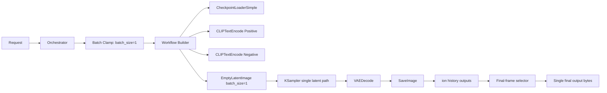

# Ion Layer Collapse Node Map

## Objective

Prevent blended multi-frame outputs by enforcing one latent path and selecting only the final rendered frame.

## Where To Patch In Ion

### A) Orchestration Gate (before workflow build)

File: src/image-gen/orchestration/ion-image-orchestrator.ts

1. Detect photoreal landscape requests.
2. Clamp batch size to 1 for this route.

Result:
- Stops multi-latent generation at source for known failure prompts.

### B) Workflow Build Stage (graph inputs and metadata)

File: src/image-gen/backend/gateway/workflow-builder.ts

1. Compute single-pass policy.
2. Force effective batch size to 1 when single-pass policy is active.
3. Emit explicit render metadata:
   - render_mode: single_pass
   - latent_merge: false
   - output_frame: final
   - cache_clear: true/false

Result:
- KSampler path receives one latent stream.
- Runtime metadata records the intended collapse behavior.

### C) Output Retrieval Stage (history selection)

File: src/image-gen/backend/gateway/ionClient.ts

1. Read all output images from history.
2. Rank by output node id and image index.
3. Return only the last candidate (final frame) instead of first available frame.

Result:
- Prevents returning intermediate images from earlier passes.

### D) Runtime Policy Flags

File: src/image-gen/config/env.ts

1. ION_RENDER_SINGLE_PASS
2. ION_CACHE_CLEAR_PER_RENDER

Defaults are set for resilient behavior.

## Node-Level Flow



## ComfyUI Equivalent Checks

1. Keep only one latent path from KSampler into VAEDecode.
2. Disable latent stack/merge nodes unless explicitly needed.
3. If tiled decode is required, use overlap 64-128 and validate seams.
4. SaveImage should persist final only.

## Validation Protocol

Use fixed seed and run:

1. photo-realistic desert landscape, no buildings
2. photo-realistic desert with sand dunes
3. photo-realistic desert at sunset

Pass criteria:

1. No blended triple-frame composite artifacts.
2. Workflow metadata shows single_pass and output_frame final.
3. Returned image corresponds to final output node/frame.

## Minimal Runtime Config

```yaml
render_mode: single_pass
latent_merge: false
cache_clear: true
output_frame: final
```
