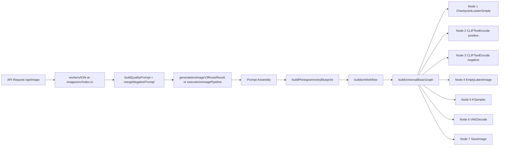
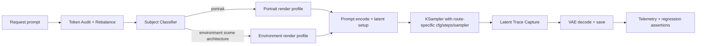

# Ion Node-Level Workflow Map for Subject Routing and Token Rebalance

## Goal

Prevent environment prompts (for example, "photo-realistic desert") from collapsing into portrait priors by adding:

1. Subject-type classification before latent sampling.
2. Prompt token rebalance so subject nouns outweigh style adjectives when needed.
3. Latent trace telemetry to verify routing and conditioning behavior.

## Current Effective Path (as implemented)

## Proposed Patched Path

## Node Insertion Points

### 1) Token Rebalance Stage

- Insert before final positive prompt merge in orchestration.
- Preferred location: `src/image-gen/orchestration/prompt-assembler.ts` in `assemblePrompt`.
- Inputs:
  - Raw prompt string.
  - Expanded tags.
  - Style tags.
  - Photogrammetry capture mode.
- Output:
  - Weighted positive token stream where subject nouns are promoted above global style adjectives for non-portrait routes.

### 2) Subject Classifier Stage

- Use existing mode inference as baseline and promote to hard routing decision.
- Preferred location: `src/image-gen/orchestration/photogrammetry-blueprint.ts` via `inferCaptureMode` and `buildPhotogrammetryBlueprint`.
- Extend output with a `routeTarget` enum:
  - `portrait`
  - `environment`
  - `scene`
  - `product`
  - `general`
- Feed this route into workflow metadata and sampler profile selection.

### 3) Workflow Route Enforcement

- Preferred location: `src/image-gen/backend/gateway/workflow-builder.ts`.
- Enforce route-specific behavior at three points:
  1. Positive text composition (`buildPositiveText`).
  2. Route-specific negative tail (`domainNegativeTail`).
  3. Metadata (`render_path`, `subject_domain`, `subject_anchors`).
- Requirement:
  - If classifier returns non-portrait route, append anti-portrait negatives and ban portrait fallback metadata.

### 4) Graph-Level Routing Branches

- Preferred location: `src/image-gen/backend/templates/universal-base-graph.ts`.
- Keep base graph stable, but inject route branch nodes before `KSampler` when route is environment/scene.
- Minimal branch policy:
  - Portrait branch: current defaults.
  - Environment branch: stricter scene coherence prompt conditioning and lower portrait affinity negatives.

## Concrete Graph Mapping

Current node IDs:

- `1` CheckpointLoaderSimple
- `2` CLIPTextEncode (positive)
- `3` CLIPTextEncode (negative)
- `4` EmptyLatentImage
- `5` KSampler
- `6` VAEDecode
- `7` SaveImage

Suggested injected virtual stages (metadata-first, then optional native nodes):

1. `90` PromptTokenAudit (logical stage in app layer)
2. `91` SubjectRouteClassifier (logical stage in app layer)
3. `92` RouteProfileResolver (logical stage chooses sampler/cfg/steps)

Then write route result into graph metadata and adjust Node `5` inputs:

- `cfg`
- `steps`
- `sampler_name`
- `scheduler`

No hard dependency on custom Comfy nodes is required for first rollout.

## Telemetry Contract (Latent Conditioning Trace)

Record for every render:

1. `route_target`
2. `capture_mode`
3. `subject_anchor_tokens`
4. `style_tokens`
5. `token_rebalance_applied` (boolean)
6. `sampler_profile`
7. `seed` and `latent_isolation_nonce`
8. `negative_tail_applied`

Primary write points:

- Workflow metadata in `buildionWorkflow`.
- Decision logs in router integration path where `latentMetadata` is already captured.

## Regression Harness

Use deterministic seeds and run the same seed set across prompts:

1. photo-realistic desert
2. photo-realistic canyon
3. photo-realistic mountain
4. photo-realistic portrait

Pass criteria:

1. Non-portrait prompts classify to `scene` or `environment`.
2. Non-portrait prompts receive anti-portrait negative tails.
3. Route metadata never reports portrait for non-portrait prompts.
4. Visual outputs preserve environmental composition without face-centric framing.

## Rollout Plan

1. Add classifier output and token rebalance metadata only.
2. Gate hard route enforcement behind an env flag.
3. Enable in staging and run regression harness.
4. Promote to production after route consistency threshold is met.

## Suggested Feature Flags

- `ION_SUBJECT_ROUTE_ENFORCEMENT=1`
- `ION_TOKEN_REBALANCE=1`
- `ION_LATENT_TRACE=1`
